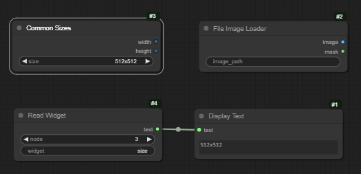
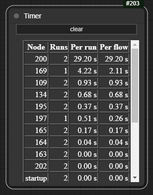

# cg-quicknodes

Quick nodes written to do one thing

## Read Widget

Give it the number of a node, and the name of a widget, and it outputs a string representation of that widget value.

## Display Text

Take any input (of any type) and display a string respresentation of it

## File Image Loader

Load an image by its full filename

## Common Sizes

A (configurable) dropdown to pick commonly used sizes. Edit `config.yaml` to change the list.

## Timer

How long does the workflow spend in each node?

## Html Node

A noed with a widget that is just some arbitrary html. This hard coded, so the node is no use to anyone at the moment.